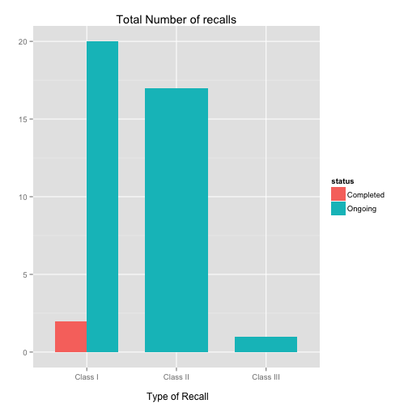

FDA Food Recalls Shiny App
========================================================
author: Marco De Solis
date: May 19, 2015
font-import: http://fonts.googleapis.com/css?family=Cabin
font-family: 'Cabin'


Introduction to the App
========================================================

This App analyzes FDA food enforcement recalls aggregated using the FDA <a href='https://open.fda.gov/food/enforcement/'> API </a>.

The API call in this presentation is currently set up to retrieve only 20 records to avoid overloading the service and getting stopped.

This app allows to track total recalls, see a breakdown by recall severity Classification, and the number of recalls and status 
(Completed, Ongoing, Terminated) by State and City.

The app is accessible from this <a href='https://marcod.shinyapps.io/FDA-food-recalls-app'> link </a>.

Food Recalls Details
========================================================

According to the FDA Recalls are classified into three categories:

- Class I a dangerous or defective product that predictably could cause serious health problems or death,
- Class II when the product might cause a temporary health problem, or pose only a slight threat of a serious nature, and
- Class III for a product that is unlikely to cause any adverse health reaction, but that violates FDA labeling or manufacturing laws.


========================================================
Generating the code to retrieve the data from the FDA API


```r
library(ggplot2)
library(RCurl)
library(jsonlite)

# Create url to read from
food_url <- getURLContent("http://api.fda.gov/food/enforcement.json?search=report_date:[20040101+TO+20131231]&limit=40")

# Parse the url to json data format
food_js_url <- fromJSON(food_url, simplifyVector=TRUE)

# Extract the data contained in 'results' to a data frame
food_df <-food_js_url[["results"]]
```


========================================================
Plotting all the food recalls for the retrieved data


```r
ggplot(food_df, aes(x = classification, fill = status)) + geom_bar(position = "dodge", width = .7) + ylab("") + ggtitle("Total Number of recalls") + xlab("\n Type of Recall")
```


